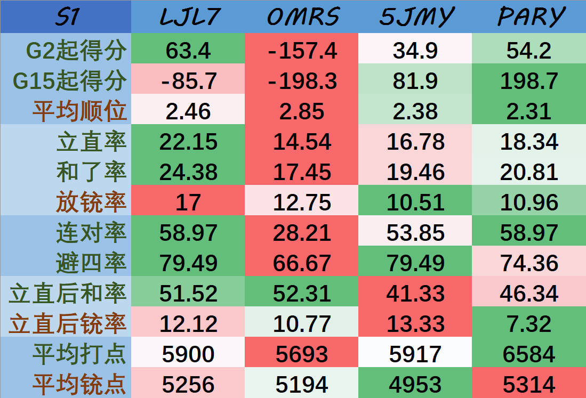
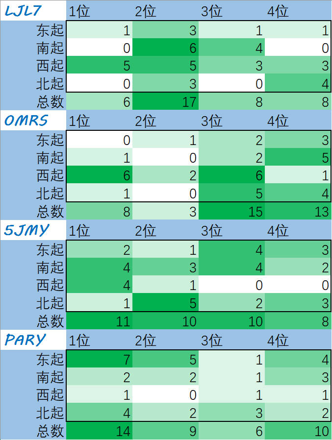

# DLeague-Data

Data and its processing codes for our DLeague.

## Statistics for S1

  
  

To view plain tables, please refer to [statistics/statistics.csv](statistics/statistics.csv) and [statistics/ranking_matrices.csv](statistics/ranking_matrices.csv).
